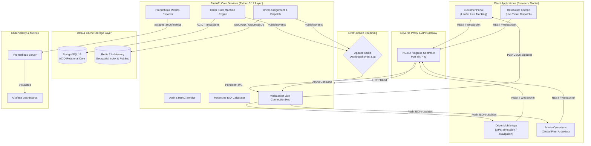
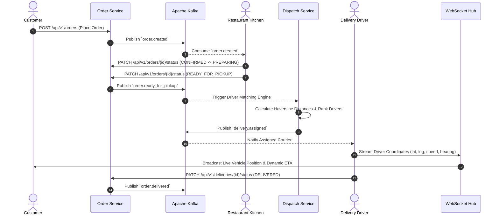
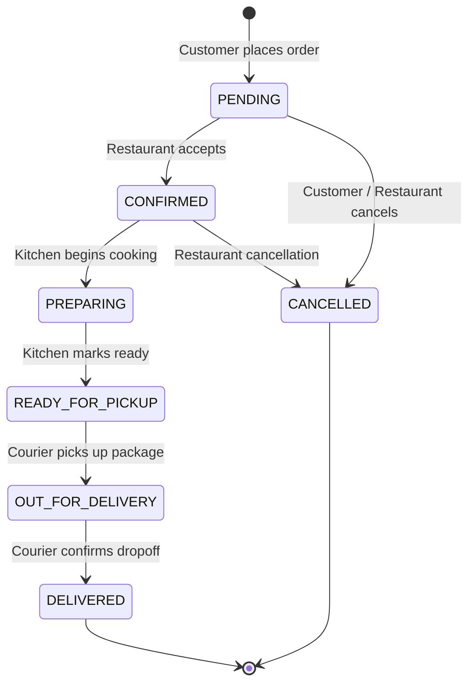

# 🚀 Real-Time Delivery & Logistics Platform

[](https://github.com/anvithayerneni/real-time-delivery-logistics-platform/actions/workflows/ci.yml)
[](https://fastapi.tiangolo.com)
[](https://nextjs.org)
[](https://www.postgresql.org)
[](https://redis.io)
[](https://kafka.apache.org)
[](https://www.docker.com)
[](https://kubernetes.io)
[](https://www.terraform.io)

An enterprise-grade, event-driven real-time food delivery and logistics platform designed for high-concurrency dispatch, sub-second GPS tracking, distributed event streaming, and multi-role operations. Built with modern microservice design principles, comprehensive telemetry, cloud-native containerization, and infrastructure-as-code.

---

## 📑 Table of Contents

- [Architectural Overview](#-architectural-overview)
  - [High-Level System Topology](#high-level-system-topology)
  - [Kafka Event Streaming Architecture](#kafka-event-streaming-architecture)
  - [Finite State Machine Engine](#finite-state-machine-engine)
  - [Real-Time GPS & Geospatial Dispatch Pipeline](#real-time-gps--geospatial-dispatch-pipeline)
- [Key Features & Role Dashboards](#-key-features--role-dashboards)
- [Technology Stack & Architectural Trade-offs](#-technology-stack--architectural-trade-offs)
- [Quick Start Guide](#-quick-start-guide)
  - [Prerequisites](#prerequisites)
  - [Option A: Running with Docker Compose (Recommended)](#option-a-running-with-docker-compose-recommended)
  - [Option B: Bare-Metal Local Development](#option-b-bare-metal-local-development)
  - [Seeding Sample Data & Default Credentials](#seeding-sample-data--default-credentials)
- [Testing & Quality Assurance](#-testing--quality-assurance)
  - [Pytest Backend Test Suite](#pytest-backend-test-suite)
  - [Playwright E2E UI Tests](#playwright-e2e-ui-tests)
- [API Reference & WebSocket Protocols](#-api-reference--websocket-protocols)
- [Cloud Infrastructure & Deployment](#-cloud-infrastructure--deployment)
  - [Kubernetes (K8s)](#kubernetes-k8s)
  - [Azure Terraform Infrastructure (IaC)](#azure-terraform-infrastructure-iac)
  - [Observability: Prometheus & Grafana](#observability-prometheus--grafana)
- [Engineering Resilience & Design Highlights](#-engineering-resilience--design-highlights)

---

## 🏛 Architectural Overview

### High-Level System Topology



### Kafka Event Streaming Architecture

The core operational services are decoupled through an asynchronous, event-driven pub/sub architecture built on Apache Kafka (with an automatic in-memory fallback for local zero-dependency testing):



### Finite State Machine Engine

Orders and deliveries transition through strictly validated finite state machines. Illegal transitions (e.g. attempting to mark a cancelled order as delivered or dispatching a driver before kitchen confirmation) raise atomic validation errors preventing inconsistent states:



### Real-Time GPS & Geospatial Dispatch Pipeline

```mermaid
flowchart LR
    DriverNode["Courier GPS Simulator<br/>(Sends every 2s)"] -->|POST /deliveries/{id}/location| BackendAPI["FastAPI Dispatcher"]
    BackendAPI -->|GEOADD drivers:geo:active| RedisGeo[("Redis Geospatial Cache")]
    BackendAPI -->|driver.location.updated| KafkaStream["Kafka Topic"]
    BackendAPI -->|Haversine Formula| ETACalc["Dynamic ETA Engine"]
    BackendAPI -->|Push WS Frame| WebSocketHub["WebSocket Hub"]
    WebSocketHub -->|{lat, lng, eta_mins, bearing}| CustomerMap["Customer Leaflet Map<br/>(Animated Vehicle Pin & Polyline)"]
```

---

## 🌟 Key Features & Role Dashboards

### 1. 🔀 1-Click Demo Role Switcher
- Located directly in the top application navigation bar.
- Switch instantly between **Customer**, **Restaurant Kitchen**, **Delivery Driver**, and **System Admin** without logging out or retyping credentials.

### 2. 🍔 Customer Portal
- **Restaurant Catalog:** Filter restaurants by cuisine type, minimum delivery time, rating, and free delivery thresholds.
- **Dynamic Menu & Cart:** Browse categorized menus, customize quantities, add special instructions, and view real-time totals with tax, delivery fee, and service fees.
- **Showcase Live Order Tracking:**
  - Interactive Leaflet map with custom pulsing vehicle icon, restaurant marker, and delivery destination marker.
  - Live animated polyline indicating driver transit route.
  - Dynamic ETA countdown updated in real time via WebSockets.
  - Step-by-step progress stepper highlighting exact kitchen and courier milestones.

### 3. 👨‍🍳 Restaurant Kitchen Dashboard
- **Live Ticket Kanban:** View incoming orders categorized by urgency and elapsed preparation time.
- **Kitchen Actions:** 1-click status transitions (`Confirm Order` ➔ `Start Preparing` ➔ `Mark Ready for Pickup`).
- **Catalog Management:** Create, toggle availability, edit prices, and manage menu items and categories.

### 4. 🛵 Delivery Driver / Courier Mobile Console
- **Active Dispatch Queue:** View pending orders ready for pickup with restaurant address, customer destination, order items, and guaranteed payout.
- **GPS Transit Simulator:** Built-in simulation tool allowing couriers to broadcast simulated driving movement along waypoints in real time, validating live WebSocket transmission to customers.
- **Delivery Confirmation:** Transition from `Accept Dispatch` ➔ `Pickup Order` ➔ `Confirm Delivery`.

### 5. 📊 Admin Operations & Analytics Console
- **System Metrics:** Real-time KPI cards tracking total revenue, gross order volume, active drivers on shift, and average fulfillment duration.
- **Recharts Data Visualizations:** Revenue distribution charts and order volume trend charts.
- **Fleet Dispatch Monitor:** Comprehensive audit table of all active deliveries, assigned couriers, and delivery timestamps.
- **User & Driver Management:** Manage users, assign RBAC permissions, and toggle driver shift availability.

---

## 🛠 Technology Stack & Architectural Trade-offs

| Component | Technology | Rationale & Trade-offs |
|---|---|---|
| **Backend Framework** | **FastAPI (Python 3.11+)** | High-performance ASGI framework with native asynchronous coroutines (`async`/`await`), automatic OpenAPI generation, and Pydantic v2 validation. Chosen over Django for lower latency and better async WebSocket concurrency. |
| **Frontend Framework** | **Next.js 14 App Router** | Hybrid React Server Components (RSC) and Client Components with TypeScript. Delivers fast initial page loads, optimal SEO, and rich real-time UI interactivity. |
| **Primary Relational Database** | **PostgreSQL 16 + SQLAlchemy 2.0 Async** | ACID-compliant relational storage ensuring strict integrity for payments, orders, and user balances. Accompanied by **SQLite `aiosqlite` dual-engine fallback** enabling standalone local testing without external database dependencies. |
| **Geospatial Store & Caching** | **Redis 7** | Sub-millisecond in-memory data store using Redis Geospatial commands (`GEOADD`, `GEORADIUS`, `GEOSEARCH`) for tracking high-frequency driver coordinates without putting load on the primary relational DB. |
| **Event Streaming** | **Apache Kafka (aiokafka)** | High-throughput distributed event log decoupling order lifecycle events from notifications, driver dispatch, and telemetry. Includes an in-memory event bus fallback for zero-infrastructure local runs. |
| **Real-Time Communication** | **WebSockets (`fastapi.WebSocket`)** | Low-latency full-duplex communication channels delivering sub-second location updates and delivery status changes directly to client maps. |
| **Map Rendering** | **Leaflet & React-Leaflet** | Lightweight open-source mapping engine without vendor lock-in or billable API key requirements, styled with custom pulsing markers and route polylines. |
| **Containerization & K8s** | **Docker & Kubernetes (AKS)** | Multi-stage Docker builds minimizing image surface area, accompanied by Kubernetes Deployments, Services, ConfigMaps, Secrets, and Ingress manifests. |
| **Infrastructure-as-Code** | **Terraform (Azure Provider)** | Declarative IaC defining Azure Resource Groups, Virtual Networks, Subnets, Azure Database for PostgreSQL, Azure Cache for Redis, and Azure Kubernetes Service (AKS). |
| **Telemetry & Observability** | **Prometheus & Grafana** | Built-in custom business metrics (`active_orders`, `driver_locations_updated_total`, `order_state_transitions_total`, `http_request_duration_seconds`) paired with pre-configured Grafana dashboards. |

---

## ⚡ Quick Start Guide

### Prerequisites
- **Git**
- **Docker & Docker Compose** (Recommended for full stack execution)
- *Alternatively for bare-metal:* **Python 3.11+**, **Node.js 18+**, and **npm**

---

### Option A: Running with Docker Compose (Recommended)

To run the entire platform including PostgreSQL, Redis, Kafka, Zookeeper, Backend API, Frontend, Prometheus, and Grafana in a single command:

```bash
# 1. Clone the repository
git clone https://github.com/anvithayerneni/real-time-delivery-logistics-platform.git
cd real-time-delivery-logistics-platform

# 2. Copy the environment variables template
cp .env.example .env

# 3. Spin up all containers
docker-compose up --build
```

Once running, access the services:
- 🌐 **Web Application:** [http://localhost:3000](http://localhost:3000)
- 🚀 **FastAPI Interactive Docs (Swagger):** [http://localhost:8000/docs](http://localhost:8000/docs)
- 📊 **Grafana Observability Dashboard:** [http://localhost:3001](http://localhost:3001) (User: `admin`, Pass: `admin`)
- 📈 **Prometheus Metrics Scraper:** [http://localhost:9090](http://localhost:9090)
- 📨 **Kafka UI Event Inspector:** [http://localhost:8080](http://localhost:8080)

---

### Option B: Bare-Metal Local Development

The platform is engineered with a **zero-dependency fallback mode**: if PostgreSQL, Redis, or Kafka are not running locally, the backend automatically utilizes SQLite (`aiosqlite`) and an internal in-memory event bus.

#### 1. Start the Backend API
```bash
# Navigate to the backend directory
cd backend

# Create and activate Python virtual environment
python3 -m venv venv
source venv/bin/activate

# Install dependencies
pip install -r requirements.txt

# Run database migrations and seed realistic mock data
python app/seed.py

# Launch the FastAPI Uvicorn server
uvicorn app.main:app --host 0.0.0.0 --port 8000 --reload
```

#### 2. Start the Frontend Application
```bash
# Open a new terminal and navigate to the frontend directory
cd frontend

# Install Node dependencies
npm install

# Start the Next.js development server
npm run dev
```

Visit [http://localhost:3000](http://localhost:3000) in your browser.

---

### Seeding Sample Data & Default Credentials

The database seed script (`backend/app/seed.py`) provisions **5 restaurants**, **30+ categorized menu items**, **10 delivery drivers**, **10 customers**, completed historical orders, and an **active live delivery** ready for map tracking:

| Role | Email | Password | Pre-configured State |
|---|---|---|---|
| **Customer** | `customer@example.com` | `password123` | Has active order `#1` currently `OUT_FOR_DELIVERY` |
| **Restaurant** | `restaurant@example.com` | `password123` | Manager of *"Bella Italia Pizzeria"* |
| **Delivery Driver** | `driver@example.com` | `password123` | Courier assigned to active order `#1` with GPS simulator |
| **Admin** | `admin@example.com` | `admin123` | Full administrative, dispatch, and telemetry privileges |

*(Tip: You can also use the **Demo Role Switcher** in the top navigation bar to switch between these users instantly with one click.)*

---

## 🧪 Testing & Quality Assurance

### Pytest Backend Test Suite
The backend is covered by automated unit and integration tests verifying authentication, RBAC authorization, state machine boundary transitions, Haversine formula ETA accuracy, driver assignment ranking, and end-to-end order dispatch workflows:

```bash
# Run the complete Pytest suite
pytest backend/tests -v

# Output summary:
# tests/test_auth.py::test_user_registration PASSED
# tests/test_auth.py::test_user_login PASSED
# tests/test_auth.py::test_invalid_credentials PASSED
# tests/test_state_machine.py::test_order_valid_transitions PASSED
# tests/test_state_machine.py::test_order_invalid_transition PASSED
# tests/test_state_machine.py::test_delivery_valid_transitions PASSED
# tests/test_state_machine.py::test_delivery_invalid_transition PASSED
# tests/test_eta.py::test_haversine_distance PASSED
# tests/test_eta.py::test_eta_calculation PASSED
# tests/test_eta.py::test_zero_distance_eta PASSED
# tests/test_driver_assignment.py::test_driver_assignment_ranking PASSED
# tests/test_driver_assignment.py::test_no_available_drivers PASSED
# tests/test_integration_flow.py::test_e2e_order_lifecycle PASSED
# ============================== 16 passed in 0.85s ==============================
```

### Playwright E2E UI Tests
End-to-end integration tests validate the full customer-to-restaurant-to-driver workflow across the Next.js client:

```bash
# Run Playwright E2E tests
cd frontend
npx playwright test
```

---

## 📡 API Reference & WebSocket Protocols

The interactive Swagger UI is available at `/docs` when the backend is running.

### Key REST Endpoints

| Method | Endpoint | Access | Description |
|---|---|---|---|
| `POST` | `/api/v1/auth/register` | Public | Register a new user account |
| `POST` | `/api/v1/auth/login` | Public | Authenticate user & return JWT token |
| `GET` | `/api/v1/restaurants` | Public | Search restaurants by location, cuisine, rating |
| `GET` | `/api/v1/restaurants/{id}/menu` | Public | Retrieve structured menu catalog |
| `POST` | `/api/v1/orders` | Customer | Create a new order with cart items |
| `GET` | `/api/v1/orders/{id}` | Authenticated | Retrieve complete order details & active status |
| `PATCH` | `/api/v1/orders/{id}/status` | Restaurant/Admin | Transition order lifecycle state |
| `POST` | `/api/v1/deliveries/{id}/assign` | Admin/System | Execute driver matching algorithm |
| `POST` | `/api/v1/deliveries/{id}/location` | Driver | Ingest courier GPS update & re-calculate ETA |
| `GET` | `/api/v1/deliveries/{id}/track` | Authenticated | Fetch current live tracking payload |
| `GET` | `/api/v1/admin/analytics/overview` | Admin | Aggregate revenue, orders, and fleet metrics |
| `GET` | `/metrics` | Prometheus | Prometheus telemetry metrics export |

### Real-Time WebSocket Protocol
- **Endpoint:** `ws://localhost:8000/ws/deliveries/{delivery_id}`
- **Message Payload (Pushed to Clients):**
```json
{
  "type": "location_update",
  "delivery_id": 1,
  "driver_id": 1,
  "driver_name": "Marcus Rodriguez",
  "driver_phone": "+1-555-0101",
  "vehicle_type": "motorcycle",
  "location": {
    "latitude": 37.7785,
    "longitude": -122.4180,
    "speed_kmh": 28.5,
    "bearing": 45.0
  },
  "eta_minutes": 8.4,
  "distance_remaining_km": 1.9,
  "status": "in_transit",
  "timestamp": "2026-09-25T15:30:00Z"
}
```

---

## ☁️ Cloud Infrastructure & Deployment

### Kubernetes (K8s)
The platform includes production-ready Kubernetes manifests located in the `k8s/` directory:
- `00-namespace.yaml`: Dedicated `logistics` isolated namespace.
- `01-configmaps-secrets.yaml`: Declarative environment variables and credentials.
- `02-postgres.yaml`: PostgreSQL StatefulSet with PersistentVolumeClaims.
- `03-redis.yaml`: Redis standalone deployment with health checks.
- `04-kafka.yaml`: Apache Kafka + Zookeeper event streaming broker.
- `05-backend.yaml`: FastAPI deployment configured with horizontal pod autoscaling and liveness/readiness probes.
- `06-frontend.yaml`: Next.js web application deployment.
- `07-ingress.yaml`: Ingress controller routing HTTP traffic to frontend and `/api` + `/ws` to the backend.

Apply to your Kubernetes cluster:
```bash
kubectl apply -f k8s/
```

### Azure Terraform Infrastructure (IaC)
Modular Terraform scripts in `terraform/` deploy the complete Azure cloud infrastructure:
- **`modules/vnet`**: Virtual Network with dedicated subnets for AKS, PostgreSQL Flexible Server, and Redis.
- **`modules/monitoring`**: Azure Log Analytics Workspace.
- **`modules/postgresql`**: Azure Database for PostgreSQL Flexible Server.
- **`modules/redis`**: Azure Cache for Redis (Standard Tier).
- **`modules/aks`**: Azure Kubernetes Service (AKS) with auto-scaling node pool and OMS Container Insights.

```bash
cd terraform
cp terraform.tfvars.example terraform.tfvars
terraform init
terraform plan
terraform apply
```

### Observability: Prometheus & Grafana
- **Prometheus** scrapes application metrics every 15 seconds from the `/metrics` endpoint.
- **Grafana** is pre-configured via automated JSON dashboards (`monitoring/grafana/dashboards/logistics_dashboard.json`) to visualize:
  - Active Orders & Delivery Status Distribution
  - Driver Assignment Latency & Dispatch Rate
  - Real-Time Location Update Throughput (events/sec)
  - HTTP Request Latencies (p50, p95, p99)

---

## 🛡 Engineering Resilience & Design Highlights

1. **Graceful Zero-Dependency Degradation:**
   - If Apache Kafka or Redis is unavailable during local development, the platform gracefully switches to an in-memory event bus and database coordinate fallback without throwing runtime crashes.
2. **Dual-Engine Database Layer:**
   - SQLAlchemy 2.0 Async abstracts the database layer, allowing full PostgreSQL concurrency in production and zero-setup SQLite in test environments.
3. **Optimistic Concurrency & Finite State Validation:**
   - Order and delivery state transitions are strictly governed by formal state machine classes. Invalid mutations return descriptive HTTP 400 validation responses.
4. **Idempotency & Event Deduplication:**
   - Driver location pings and order confirmation webhooks are designed to handle repeated delivery attempts safely without corrupting order balances.
5. **Decoupled Geospatial Indexing:**
   - Fast driver spatial queries utilize Redis Geospatial commands (`GEOADD`, `GEORADIUS`), shielding the primary PostgreSQL database from thousands of high-frequency GPS writes per minute.

---

## 📄 License
This project is open-source and licensed under the [MIT License](LICENSE).
