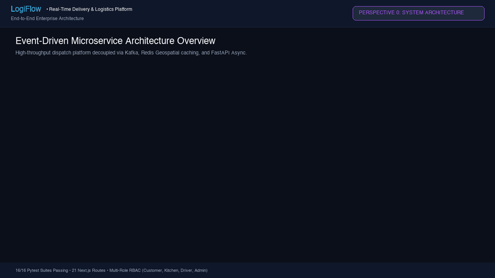
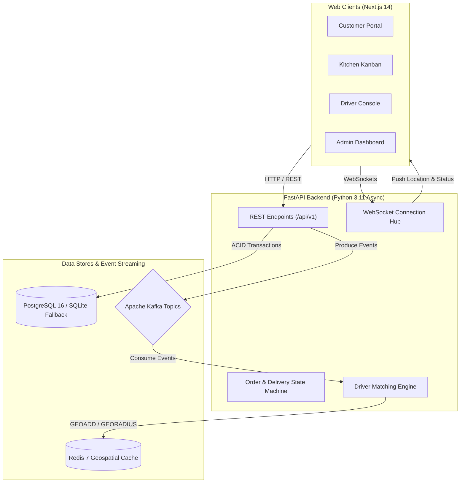

# LogiFlow: Real-Time Logistics

[](https://github.com/anvithayerneni/LogiFlow-Real-Time-Logistics/actions/workflows/ci.yml)
[](LICENSE)

LogiFlow is a real-time food delivery and logistics platform with live GPS driver tracking, event streaming, and role-based dashboards. 

The backend is built with FastAPI, PostgreSQL, and SQLAlchemy 2.0 Async, using Apache Kafka for event-driven order processing and Redis for sub-second driver location caching. The frontend is built with Next.js 14 (App Router), Tailwind CSS, and Leaflet.



---

## Live Links

| Link | Description |
|---|---|
| [Web Application](https://corn-fifty-wed-role.trycloudflare.com) | Main application with 1-click demo role switcher in the navbar |
| [Live Tracking Showcase](https://corn-fifty-wed-role.trycloudflare.com/customer/orders/f19b8d92-9a0f-4fe1-baf7-53a58f6e7d9b) | Interactive Leaflet tracking map for active order #F19B |
| [Driver GPS Console](https://corn-fifty-wed-role.trycloudflare.com/driver/deliveries/f19b8d92-9a0f-4fe1-baf7-53a58f6e7d9b) | Courier dispatch view with live transit simulator |
| [Kitchen Order Board](https://corn-fifty-wed-role.trycloudflare.com/restaurant/orders) | Kitchen ticket workflow (confirm, cook, mark ready) |
| [Admin Analytics](https://corn-fifty-wed-role.trycloudflare.com/admin) | Revenue charts, active driver monitor, and order history |
| [API Documentation](http://localhost:8000/docs) | Interactive Swagger docs for all REST endpoints |
| [System Architecture & Spec](docs/SYSTEM_DOCUMENTATION.md) | In-depth engineering guide, ER diagrams, state machines, and algorithms |
| [Demo Video (MP4)](docs/full_platform_demo.mp4) | Downloadable 720p HD walkthrough video |

---

## Architecture



### Event Streaming (Kafka)
The platform uses Kafka topics to decouple lifecycle events:
- `order.created`: Published when a customer submits an order.
- `order.confirmed` & `order.ready_for_pickup`: Published by the restaurant kitchen.
- `delivery.assigned`: Emitted when the dispatch engine matches a driver.
- `driver.location.updated`: High-frequency driver GPS coordinates pushed to Redis and broadcast over WebSockets.
- `delivery.delivered`: Final drop-off and settlement.

An in-memory event bus is used automatically as a fallback when running locally without a Kafka broker.

### State Machine
Order and delivery transitions are enforced with strict validation:
- Order: `PENDING` -> `CONFIRMED` -> `PREPARING` -> `READY_FOR_PICKUP` -> `OUT_FOR_DELIVERY` -> `DELIVERED` (or `CANCELLED`)
- Delivery: `PENDING` -> `ASSIGNED` -> `PICKED_UP` -> `IN_TRANSIT` -> `DELIVERED`

---

## Features

- **Demo Role Switcher:** A dropdown in the top navigation bar lets you switch between Customer, Restaurant, Driver, and Admin with one click.
- **Customer View:** Browse restaurants by category, add dishes to cart, checkout, and watch deliveries move on an interactive Leaflet map with route polylines and live ETA.
- **Restaurant View:** Kanban-style order board with timers showing how long tickets have been waiting, plus catalog management for menu items.
- **Driver View:** Mobile-styled courier cockpit showing guaranteed payout, pickup/drop-off directions, and an interactive GPS simulator that drives along realistic San Francisco streets.
- **Admin View:** Summary KPI cards (revenue, orders, active couriers, fulfillment time), order velocity charts, and active delivery monitoring.

---

## Getting Started

### Option 1: Docker Compose

Runs PostgreSQL, Redis, Kafka, the FastAPI backend, the Next.js frontend, Prometheus, and Grafana:

```bash
git clone https://github.com/anvithayerneni/LogiFlow-Real-Time-Logistics.git
cd LogiFlow-Real-Time-Logistics
cp .env.example .env
docker-compose up --build
```

Endpoints once running:
- Frontend: `http://localhost:3000`
- Backend API Docs: `http://localhost:8000/docs`
- Grafana: `http://localhost:3001` (admin / admin)
- Prometheus: `http://localhost:9090`
- Kafka UI: `http://localhost:8080`

### Option 2: Local Setup (SQLite Mode)

Runs without external dependencies using SQLite and the in-memory event bus.

1. **Backend:**
   ```bash
   cd backend
   python3 -m venv venv
   source venv/bin/activate
   pip install -r requirements.txt
   PYTHONPATH=. python app/seed.py
   uvicorn app.main:app --host 0.0.0.0 --port 8000 --reload
   ```

2. **Frontend:**
   ```bash
   cd frontend
   npm install
   npm run dev
   ```
   Open `http://localhost:3000` (or `http://localhost:3002` if port 3000 is occupied).

---

## Demo Accounts

The database seed (`backend/app/seed.py`) includes 5 restaurants, 30+ menu items, 10 drivers, and an active order (`#F19B8D`) ready for live tracking:

| Role | Email | Password | Details |
|---|---|---|---|
| Customer | `customer@example.com` | `password123` | Active order currently in transit |
| Restaurant | `restaurant@example.com` | `password123` | Manager of Bella Napoli Trattoria |
| Driver | `driver@example.com` | `password123` | Courier assigned to active order #F19B8D |
| Admin | `admin@example.com` | `admin123` | Full access to platform analytics and dispatch |

You can also switch roles instantly using the dropdown in the website's top navigation bar.

---

## Testing

Backend unit and integration tests (auth, state machine transitions, Haversine ETA formula, driver matching algorithm, and end-to-end delivery lifecycle):

```bash
pytest backend/tests -v
```

Frontend lint and build check:

```bash
cd frontend
npm run lint
npm run build
```

End-to-end tests with Playwright:

```bash
cd frontend
npx playwright test
```

---

## Project Structure

```text
logiflow/
├── backend/
│   ├── alembic/              # Database migrations
│   ├── app/
│   │   ├── api/v1/           # REST routers (auth, orders, drivers, etc.)
│   │   ├── core/             # Config, security, database, telemetry
│   │   ├── events/           # Kafka topics, bus, and in-memory fallback
│   │   ├── models/           # SQLAlchemy models
│   │   ├── schemas/          # Pydantic v2 schemas
│   │   ├── services/         # State machine, ETA, dispatch, payments
│   │   └── websockets/       # Real-time WebSocket connection manager
│   ├── tests/                # Pytest test suite (16 tests)
│   └── Dockerfile
├── frontend/
│   ├── src/
│   │   ├── app/              # Next.js 14 App Router pages
│   │   ├── components/       # Leaflet map, Navbar, UI cards
│   │   ├── context/          # Auth and Cart React context
│   │   └── lib/              # API fetch client
│   └── Dockerfile
├── k8s/                      # Kubernetes manifests (deployments, services, ingress)
├── monitoring/               # Prometheus config and Grafana dashboards
├── terraform/                # Azure IaC (AKS, PostgreSQL, Redis, VNet)
├── docker-compose.yml
└── render.yaml               # 1-click cloud deployment blueprint
```

---

## License

This project is licensed under the [MIT License](LICENSE).
