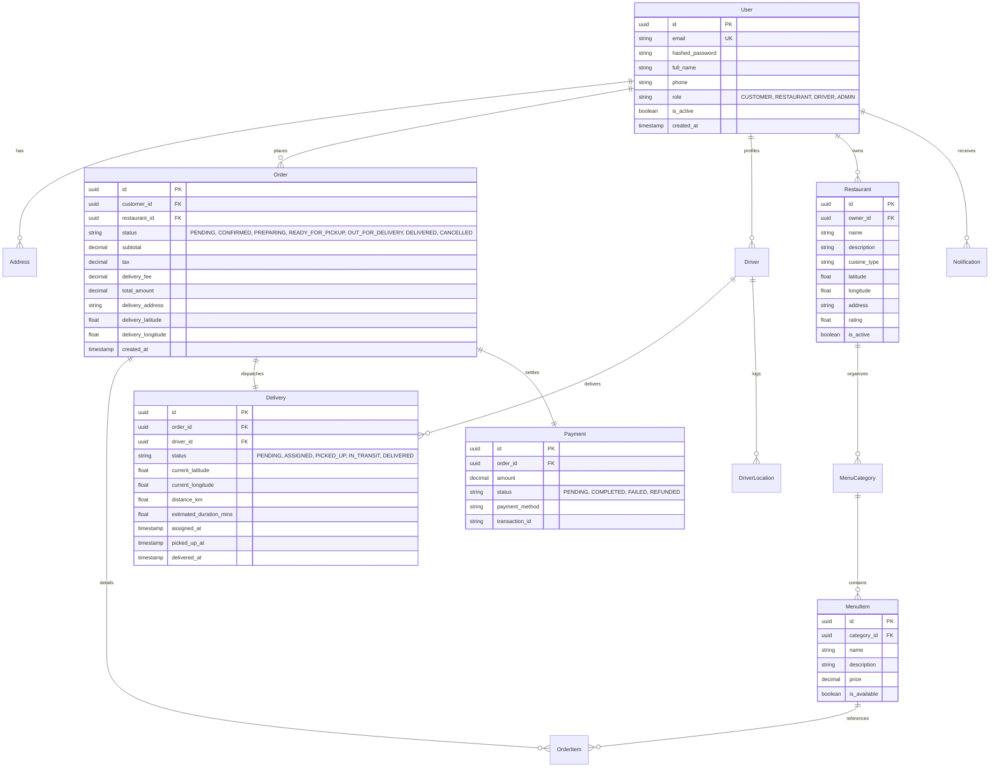
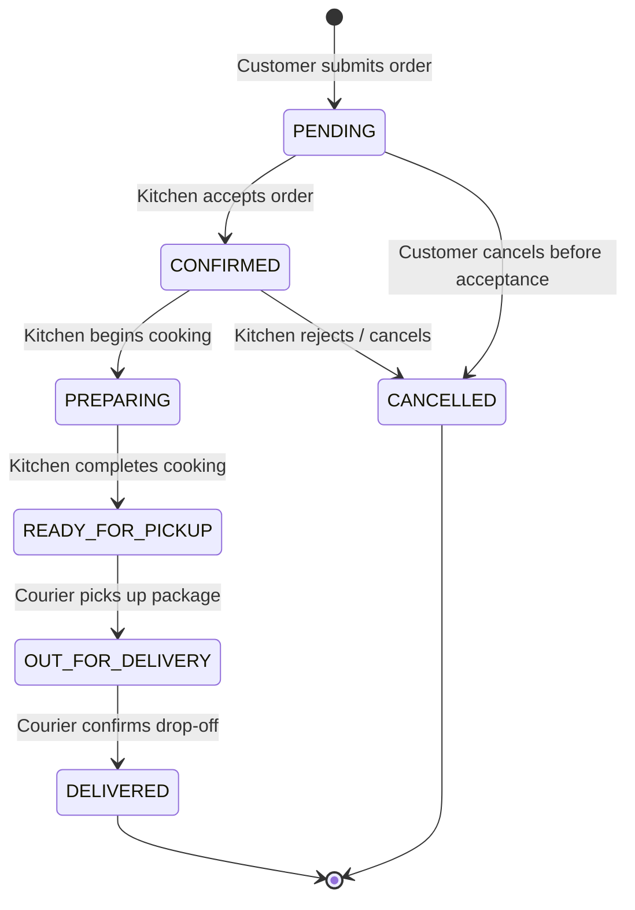

# LogiFlow: Complete System Architecture & Technical Documentation

This document serves as the comprehensive engineering guide, architecture specification, operational runbook, and technical reference for **LogiFlow**.

---

## 1. Executive Summary & Core Tenets

LogiFlow is an event-driven, real-time food delivery and logistics orchestration platform engineered to handle high-concurrency order processing, sub-second GPS courier tracking, and multi-role operations across four primary user personas: Customers, Restaurants, Delivery Drivers, and System Administrators.

### Core Architectural Tenets
1. **Event-Driven Decoupling:** Long-running, asynchronous, and fan-out workflows (such as driver dispatch matching, notification delivery, and telemetry aggregation) are decoupled from synchronous HTTP request/response loops via Apache Kafka event streaming.
2. **Sub-Second Telematics Pipeline:** Courier GPS coordinates bypass heavy relational disk writes by routing directly through an in-memory Redis Geospatial cache before broadcasting to subscribers via persistent WebSockets.
3. **Resilience & Zero-Dependency Fallback:** The platform incorporates dual-engine database abstraction (PostgreSQL for production ACID transactions, SQLite `aiosqlite` for zero-setup local development) and an internal in-memory event bus fallback when external message brokers are unavailable.
4. **Invariant Integrity via Finite State Machines:** Order and delivery lifecycles are governed by deterministic finite state machines, preventing race conditions, invalid transitions (e.g., reverting a delivered order), or orphan deliveries.
5. **Cloud-Native & Infrastructure-as-Code:** Fully containerized with multi-stage Docker builds, automated Kubernetes manifests, modular Azure Terraform definitions, and GitHub Actions CI/CD pipelines.

---

## 2. High-Level Architecture & Topology

```mermaid
flowchart TB
    subgraph ClientLayer ["Client Applications (Next.js 14 App Router)"]
        Customer["Customer Portal<br/>(Discovery, Cart, Leaflet Tracking)"]
        Restaurant["Restaurant Kitchen<br/>(Live Ticket Kanban Board)"]
        Driver["Courier Cockpit<br/>(GPS Motion Simulator)"]
        Admin["Admin Operations<br/>(Fleet Analytics & Telemetry)"]
    end

    subgraph IngressGateway ["API Gateway & Ingress Layer"]
        Ingress["Kubernetes Ingress / Reverse Proxy<br/>Port 80 / 443"]
    end

    subgraph BackendCore ["FastAPI Core Services (Python 3.11 Async)"]
        AuthSvc["Auth & RBAC (JWT / Bcrypt)"]
        OrderSvc["Order Management Service"]
        FSM["State Machine Engine"]
        DispatchSvc["Driver Assignment Engine"]
        ETASvc["Haversine ETA Calculator"]
        WSHub["WebSocket Connection Hub"]
        Metrics["Prometheus Exporter (:8000/metrics)"]
    end

    subgraph DataStorage ["Data & Cache Layer"]
        Postgres[("PostgreSQL 16 (Primary ACID)<br/>SQLAlchemy 2.0 Async")]
        RedisStore[("Redis 7 In-Memory Cache<br/>GEOADD / GEORADIUS")]
    end

    subgraph Messaging ["Event Streaming Fabric"]
        KafkaBus{"Apache Kafka 3.6 Broker<br/>12 Event Topics"}
    end

    subgraph Observability ["Observability Stack"]
        Prometheus["Prometheus Server (15s scrape)"]
        Grafana["Grafana Dashboards"]
    end

    Customer & Restaurant & Driver & Admin -->|HTTPS REST| Ingress
    Customer & Driver & Admin -->|WSS WebSockets| Ingress
    Ingress --> BackendCore

    OrderSvc -->|ACID Transactions| Postgres
    OrderSvc -->|Publish Order Events| KafkaBus
    KafkaBus -->|Consume order.ready_for_pickup| DispatchSvc
    DispatchSvc -->|GEOADD / GEORADIUS| RedisStore
    Driver -->|POST /deliveries/{id}/location| RedisStore
    RedisStore -->|Driver Coordinates| WSHub
    WSHub -->|Push JSON Telematics| Customer & Admin

    Metrics -->|Scrape /metrics| Prometheus
    Prometheus -->|Visualize| Grafana
```

---

## 3. Technology Stack & Component Justifications

| Layer | Technology | Version | Engineering Rationale |
|---|---|---|---|
| **API Framework** | FastAPI (Python) | 0.110+ | Native asynchronous coroutines (`async`/`await`), ASGI standard compliance, automatic OpenAPI Swagger generation, and high request concurrency. |
| **Data Validation** | Pydantic V2 | 2.6+ | Rust-backed validation core delivering high serialization/deserialization throughput and strict type safety. |
| **Relational DB** | PostgreSQL | 16.0 | ACID compliance for financial and transactional guarantees. Powered by SQLAlchemy 2.0 Async (`asyncpg`). |
| **Local DB Fallback** | SQLite (`aiosqlite`) | 3.x | Zero-friction local development without requiring local database daemon installations. |
| **Geospatial Store** | Redis | 7.2 | In-memory spatial indexing using `GEOADD` and `GEORADIUS` for sub-millisecond courier queries without primary database locks. |
| **Event Streaming** | Apache Kafka | 3.6 | High-throughput distributed append-only log decoupling asynchronous microservices. Built with `aiokafka` and an in-memory event bus fallback. |
| **Real-Time Comms** | WebSockets | Native | Full-duplex, low-latency socket connections pushing live coordinate frames to connected client tracking pages. |
| **Frontend Framework**| Next.js | 14.2 (App Router) | Server-side rendering (SSR) for initial loads combined with React client interactivity for dynamic maps and charts. |
| **Mapping Engine** | Leaflet / React-Leaflet| 1.9 / 4.2 | Open-source, lightweight mapping library without external API billing limits or vendor lock-in. |
| **Data Visualization**| Recharts | 2.12 | Composable SVG chart components for real-time order velocity and revenue distribution dashboards. |
| **Containerization** | Docker | Multi-Stage | Multi-stage Dockerfiles separating build dependencies from minimal production runtime layers. |
| **Orchestration** | Kubernetes | 1.28+ | Declarative Deployments, StatefulSets, Services, ConfigMaps, Secrets, and Ingress routing rules. |
| **Cloud IaC** | Terraform (Azure) | 1.5+ | Declarative Azure cloud infrastructure (VNet, Subnets, AKS, PostgreSQL Flexible Server, Redis Cache). |

---

## 4. Database Schema & Entity Relationships

The relational data model is designed around transactional consistency, foreign key constraints, and performance indexes.



---

## 5. Finite State Machine Engines

To guarantee data integrity across concurrent requests, both Orders and Deliveries are managed through deterministic Finite State Machines (FSM). Any attempt to execute an invalid transition raises an atomic validation error (HTTP 400).

### Order State Transitions



### Delivery State Transitions
- `PENDING` $\rightarrow$ `ASSIGNED`: Dispatch engine matches available driver.
- `ASSIGNED` $\rightarrow$ `PICKED_UP`: Courier arrives at restaurant and collects order.
- `PICKED_UP` $\rightarrow$ `IN_TRANSIT`: Courier departs restaurant heading to customer.
- `IN_TRANSIT` $\rightarrow$ `DELIVERED`: Courier arrives at destination and completes handoff.

---

## 6. Real-Time Telematics & Dispatch Algorithms

### 1. Haversine Distance & Dynamic ETA Calculation
Calculates the great-circle distance between two geographic coordinates on a sphere:

$$\Delta\sigma = 2 \arcsin \left( \sqrt{\sin^2\left(\frac{\Delta\phi}{2}\right) + \cos(\phi_1)\cos(\phi_2)\sin^2\left(\frac{\Delta\lambda}{2}\right)} \right)$$

$$d = R \cdot \Delta\sigma$$

Where $R = 6,371\text{ km}$ (mean Earth radius), $\phi$ is latitude, and $\lambda$ is longitude in radians.

* **Estimated Travel Time:**
$$\text{Transit Minutes} = \left( \frac{d}{\bar{v}} \times 60 \right) + \text{Traffic Buffer}$$
Where $\bar{v}$ is the average urban transit velocity ($25\text{--}35\text{ km/h}$).

### 2. Multi-Factor Driver Dispatch Algorithm
When an order reaches `READY_FOR_PICKUP`, candidate drivers within a $5.0\text{ km}$ radius are scored:

$$\text{Score} = w_1 \cdot \hat{D} + w_2 \cdot \hat{L} + w_3 \cdot (1 - \hat{R}) + w_4 \cdot (1 - \hat{I})$$

* **Weights:**
  * $w_1 = 0.50$ (Proximity Distance)
  * $w_2 = 0.25$ (Active Delivery Load)
  * $w_3 = 0.15$ (Customer Rating)
  * $w_4 = 0.10$ (Idle Duration on Shift)
* The driver with the lowest combined cost score is atomically assigned via database lock.

### 3. Redis Geospatial Coordinate Ingestion Pipeline
1. Driver mobile client pings `POST /api/v1/deliveries/{id}/location` every 2 seconds.
2. Coordinates are stored in Redis via `GEOADD drivers:geo <lng> <lat> <driver_id>`.
3. Coordinates are logged to `driver.location.updated` Kafka topic.
4. WebSocket hub broadcasts the updated frame to all active order tracking listeners.

---

## 7. Event-Driven Messaging (Kafka Topics)

| Topic Name | Producer | Consumer | Payload Description |
|---|---|---|---|
| `order.created` | Order Service | Restaurant Service | Initial order creation event with cart items and delivery address. |
| `order.confirmed` | Restaurant Kitchen | Notification Service | Kitchen acceptance confirmation event. |
| `order.preparing` | Restaurant Kitchen | Analytics / Customer | Kitchen cooking progress milestone. |
| `order.ready_for_pickup` | Restaurant Kitchen | Dispatch Engine | Triggers candidate driver radius matching algorithm. |
| `delivery.assigned` | Dispatch Engine | Courier WebSocket | Dispatches delivery assignment payload to driver mobile cockpit. |
| `delivery.picked_up` | Courier Mobile | Customer WebSocket | Package collected from kitchen, transit begins. |
| `driver.location.updated`| Courier Mobile | WebSocket Hub | High-frequency telemetry: `{lat, lng, speed, bearing, eta}`. |
| `delivery.delivered` | Courier Mobile | Order & Payment Service | Final order settlement and customer completion alert. |
| `order.cancelled` | Customer / Admin | Payment / Notification | Triggers simulated refund and alerts stakeholders. |

---

## 8. Role-Based Access Control (RBAC) & Default Credentials

The platform enforces JWT Bearer authentication with role claims. A 1-click Demo Role Switcher is built into the website header for presentations.

| Role | Default Email | Password | Pre-configured State & Capabilities |
|---|---|---|---|
| **CUSTOMER** | `customer@example.com` | `password123` | Active showcase order `#F19B8D` currently `OUT_FOR_DELIVERY` on live Leaflet map. |
| **RESTAURANT** | `restaurant@example.com` | `password123` | Manager of *Bella Napoli Trattoria*. Kitchen Kanban ticket board with elapsed timers. |
| **DRIVER** | `driver@example.com` | `password123` | Courier assigned to order `#F19B8D`. Real-time GPS transit simulator console. |
| **ADMIN** | `admin@example.com` | `admin123` | Full administrative permissions, revenue analytics charts, fleet dispatch audit. |

---

## 9. API Reference & WebSocket Protocols

### Core REST Endpoints

| HTTP Method | Endpoint | Authorization | Description |
|---|---|---|---|
| `POST` | `/api/v1/auth/register` | Public | Register new user account. |
| `POST` | `/api/v1/auth/login` | Public | Authenticate credentials and return JWT bearer token. |
| `GET` | `/api/v1/users/me` | Authenticated | Retrieve authenticated user profile. |
| `GET` | `/api/v1/restaurants` | Public | Search restaurants with filters (cuisine, rating, radius). |
| `GET` | `/api/v1/restaurants/{id}/menu`| Public | Fetch structured menu categories and dishes. |
| `POST` | `/api/v1/orders` | Customer | Place an order with line items and delivery coordinates. |
| `GET` | `/api/v1/orders/{id}` | Authenticated | Fetch order details, line items, and active delivery status. |
| `PATCH` | `/api/v1/orders/{id}/status` | Restaurant/Admin| Advance order lifecycle state (FSM validated). |
| `POST` | `/api/v1/deliveries/{id}/assign`| System/Admin | Trigger automated driver matching engine. |
| `POST` | `/api/v1/deliveries/{id}/location`| Driver | Ingest courier GPS telemetry and calculate new ETA. |
| `GET` | `/api/v1/deliveries/{id}/track` | Authenticated | Fetch active tracking payload with vehicle coordinates. |
| `GET` | `/api/v1/admin/analytics/overview`| Admin | Retrieve platform KPIs, revenue, and fleet counts. |
| `GET` | `/metrics` | Public / Scraper | Prometheus telemetry metrics scrape endpoint. |

### Real-Time WebSocket Protocol
* **URI:** `ws://<host>/ws/deliveries/{delivery_id}`
* **Downlink Telemetry Frame:**
```json
{
  "type": "DRIVER_LOCATION_UPDATE",
  "delivery_id": "f19b8d92-9a0f-4fe1-baf7-53a58f6e7d9b",
  "driver_id": "02294eab-1741-4054-ba6b-d23d4b88f023",
  "driver_name": "Marcus Rodriguez",
  "latitude": 37.7785,
  "longitude": -122.4180,
  "speed_kmh": 28.5,
  "bearing": 45.0,
  "distance_remaining_km": 1.95,
  "eta_minutes": 7.8,
  "status": "OUT_FOR_DELIVERY",
  "timestamp": "2026-09-25T20:30:00Z"
}
```

---

## 10. Local Development & Deployment Runbook

### Option A: One-Command Docker Compose
Spins up PostgreSQL, Redis, Kafka, Zookeeper, Backend API, Frontend, Prometheus, and Grafana:
```bash
git clone https://github.com/anvithayerneni/LogiFlow-Real-Time-Logistics.git
cd LogiFlow-Real-Time-Logistics
cp .env.example .env
docker-compose up --build
```
* **Frontend:** `http://localhost:3000`
* **FastAPI Docs:** `http://localhost:8000/docs`
* **Grafana Dashboard:** `http://localhost:3001` (admin / admin)
* **Prometheus:** `http://localhost:9090`
* **Kafka UI:** `http://localhost:8080`

### Option B: Bare-Metal Setup (Zero-Dependency SQLite Mode)
1. **Backend:**
   ```bash
   cd backend
   python3 -m venv venv && source venv/bin/activate
   pip install -r requirements.txt
   PYTHONPATH=. python app/seed.py
   uvicorn app.main:app --host 0.0.0.0 --port 8000 --reload
   ```
2. **Frontend:**
   ```bash
   cd frontend
   npm install
   npm run dev
   ```

---

## 11. Kubernetes & Cloud Infrastructure (IaC)

### Kubernetes Manifests (`k8s/`)
* `00-namespace.yaml`: Creates isolated `logistics` namespace.
* `01-configmaps-secrets.yaml`: Declarative environment variables and credentials.
* `02-postgres.yaml`: StatefulSet with PersistentVolumeClaims.
* `03-redis.yaml`: In-memory cache deployment and ClusterIP service.
* `04-kafka.yaml`: Apache Kafka and Zookeeper stateful streaming cluster.
* `05-backend.yaml`: FastAPI deployment with auto-scaling probes.
* `06-frontend.yaml`: Next.js web application deployment.
* `07-ingress.yaml`: Ingress controller routing web traffic to frontend and `/api` + `/ws` to backend.

### Azure Terraform Infrastructure (`terraform/`)
* **`modules/vnet`**: Azure Virtual Network with dedicated subnets for AKS, PostgreSQL Flexible Server, and Redis.
* **`modules/monitoring`**: Azure Log Analytics Workspace.
* **`modules/postgresql`**: Azure Database for PostgreSQL Flexible Server.
* **`modules/redis`**: Azure Cache for Redis (Standard Tier).
* **`modules/aks`**: Azure Kubernetes Service cluster with auto-scaling node pool.

---

## 12. Verification & Testing

### Pytest Backend Test Suite (16/16 Passing)
```bash
pytest backend/tests -v
```
* `test_auth.py`: User registration, password hashing, JWT expiration, RBAC enforcement.
* `test_state_machine.py`: Order and delivery valid/invalid state transitions.
* `test_eta.py`: Haversine distance, travel duration, edge cases.
* `test_driver_assignment.py`: Multi-factor candidate scoring and driver ranking.
* `test_integration_flow.py`: Full 12-step end-to-end order lifecycle simulation.

### Playwright E2E UI Tests
```bash
cd frontend && npx playwright test
```

---

## 13. Senior Engineering Trade-offs & Discussion Points

1. **Why FastAPI over Django or Flask?**
   * FastAPI's native ASGI coroutine model handles thousands of concurrent, idle WebSocket tracking connections with low memory overhead compared to WSGI threaded servers.
2. **Why Redis Geospatial over PostGIS for real-time tracking?**
   * Courier telemetry updates arrive every 2 seconds. Writing high-frequency GPS pings to PostgreSQL causes write-amplification, index bloat, and vacuuming churn. Storing dynamic coordinates in Redis in-memory structures (`GEOADD`) decouples high-frequency telemetry from relational data storage.
3. **Graceful Zero-Dependency Fallback:**
   * In local development, the platform automatically switches to SQLite and an in-memory event bus if Kafka or Redis is unavailable, drastically reducing setup friction for developer onboarding.
4. **Idempotent Order Transitions:**
   * State transitions check current state before applying updates, guaranteeing idempotency during network retries or duplicate webhook delivery.
